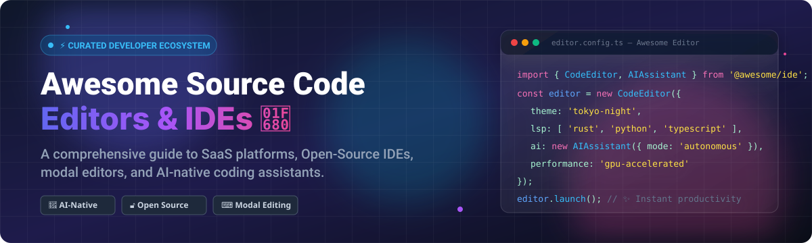

# Awesome Source Code Editor 🚀

  
  
  
  
  
  

## 📌 Overview & SEO Meta Summary

Welcome to the definitive **Curated List of Source Code Editors, Open-Source IDEs, Commercial SaaS Platforms, and AI-Native Coding Assistants**! 💻⚡

Whether you are seeking lightweight text editors like **Vim**, **Micro**, or **Lite XL**, high-performance modal editors like **Neovim** and **Helix**, GPU-accelerated environments like **Zed**, or AI pair programmers like **Cursor**, **Windsurf**, **Continue**, and **OpenHands**, this awesome directory indexes top-rated software engineering tools.

---

## 📑 Table of Contents

- [🏢 SaaS & Commercial Platforms](#-saas--commercial-platforms)
- [🔓 Open-Source GitHub Repositories](#-open-source-github-repositories)
- [🛠️ How to Contribute](#️-how-to-contribute)
- [⚠️ Disclaimer](#️-disclaimer)
- [💖 Support & Sponsorship](#-support--sponsorship)
- [⭐ Star History](#-star-history)

---

## 🏢 SaaS & Commercial Platforms

> 📊 **Market Overview**: The global source code editor and developer productivity tool market is estimated at **$7.2 Billion** in 2026 and is projected to reach **$18.5 Billion by 2032** (CAGR ~14.8%). The core IDE sector is **moderately concentrated** (dominated by VS Code engine adoption), while the sub-sector for AI-native code editors and agentic assistants is **highly fragmented** with aggressive venture-backed competition.

Below is a curated overview of leading SaaS & commercial code editing platforms, sorted by **Company Size (Valuation / Revenue)** in descending order:

| 🚀 Product | 📝 Description | 💰 Starting Price | 🎁 Free Tier Limit | 🏢 Company Size (Valuation / Revenue) |
| :--- | :--- | :--- | :--- | :--- |
| **[Cursor](https://cursor.com/)** | AI-native code editor built as a VS Code fork featuring Composer multi-file editing and agentic workflows. | $20/month (Pro Plan) | Free Hobby Plan: 2,000 completions/mo + 50 slow premium requests/mo | **$2.5 Billion Valuation** |
| **[Windsurf](https://windsurf.com/)** | AI-native IDE by Codeium equipped with Cascade agent for deep context awareness and multi-file refactoring. | $15/month (Pro Plan) | Free Tier: Unlimited autocomplete + 60 prompt credits/mo | **$1.25 Billion Valuation** |
| **[Nova](https://nova.app/)** | Native macOS source code editor created by Panic with integrated Git tools, terminal, and extension ecosystem. | $99 one-time ($49 annual renewal) | 14-day fully functional free trial plan | **~$20 Million Revenue** |
| **[Sublime Text](https://www.sublimetext.com/)** | Ultra-fast, lightweight commercial text editor renowned for multi-cursor editing, speed, and command palette. | $99 one-time (includes 3 years updates) | Unlimited free evaluation period with purchase popup reminders | **~$15 Million Revenue** |
| **[TextMate](https://macromates.com/)** | Classic macOS text editor that pioneered scoped syntax grammars, snippets, and modular bundle architectures. | $56 one-time license fee | 30-day free trial plan | **~$2 Million Revenue** |

---

## 🔓 Open-Source GitHub Repositories

Explore top open-source code editors, terminal text tools, and AI coding assistants. Repositories below are ordered by **GitHub Star Count** (descending):

1. 🥇 **[Visual Studio Code (VS Code OSS)](https://github.com/microsoft/vscode)**   
   **The world's most popular code editor engine** (193.5k+ ⭐ | MIT Licensed). Built with TypeScript and Electron, featuring 50,000+ extensions, integrated terminal, Git workflows, and debugging.

2. 🥈 **[Neovim](https://github.com/neovim/neovim)**   
   **Hyperextensible Vim-based text editor** (102.8k+ ⭐ | Apache-2.0 / Vim Licensed). Modern Vim refactor featuring native LSP client, Tree-sitter syntax parsing, and Lua plugin ecosystem.

3. 🥉 **[Zed](https://github.com/zed-industries/zed)**   
   **High-performance, multiplayer code editor** (91.3k+ ⭐ | GPL-3.0 Licensed). Built in Rust by Atom & Tree-sitter creators, featuring GPU-accelerated rendering and built-in AI assistance.

4. 🤖 **[OpenHands](https://github.com/All-Hands-AI/OpenHands)**   
   **Autonomous AI software engineer agent** (90.0k+ ⭐ | MIT Licensed). Executes multi-step coding tasks, shell commands, web searches, and file modifications in Docker sandboxes.

5. ⚛️ **[Atom](https://github.com/atom/atom)**   
   **The hackable text editor for the 21st century** (60.7k+ ⭐ | MIT Licensed). Pioneer web-tech desktop editor developed by GitHub (archived; inspired modern tools like VS Code & Zed).

6. 🐍 **[Aider](https://github.com/Aider-AI/aider)**   
   **Terminal-based AI pair programming tool** (49.4k+ ⭐ | Apache-2.0 Licensed). Edits code directly in local repositories, connects with any LLM, and auto-commits git changes.

7. 🌐 **[Monaco Editor](https://github.com/microsoft/monaco-editor)**   
   **Browser-based code editor component** (46.8k+ ⭐ | MIT Licensed). The core web editing UI component powering Visual Studio Code online and web IDE platforms.

8. 🌀 **[Helix](https://github.com/helix-editor/helix)**   
   **Post-modern modal text editor** (46.5k+ ⭐ | MPL-2.0 Licensed). Terminal-based Rust editor featuring Kakoune selection-first editing, built-in Tree-sitter, and zero-config LSP.

9. ⚡ **[Vim](https://github.com/vim/vim)**   
   **The ubiquitous modal text editor** (41.1k+ ⭐ | Vim Charityware). Highly configurable terminal editor providing efficient keyboard navigation pre-installed across Unix systems.

10. ⚡ **[Lapce](https://github.com/lapce/lapce)**   
    **Lightning-fast Rust code editor** (38.9k+ ⭐ | Apache-2.0 Licensed). Built with Floem UI toolkit, featuring native GPU acceleration, remote development, Vim mode, and WASI plugins.

11. 💡 **[Continue](https://github.com/continuedev/continue)**   
    **Leading open-source AI code assistant** (36.1k+ ⭐ | Apache-2.0 Licensed). Extension for VS Code and JetBrains bringing autocomplete, chat, and codebase editing with BYO-LLM support.

12. 🛡️ **[VSCodium](https://github.com/VSCodium/vscodium)**   
    **Telemetry-free, open-source build of VS Code** (33.5k+ ⭐ | MIT Licensed). Community binaries removing Microsoft branding, telemetry, and proprietary marketplace restrictions.

13. 🐭 **[Micro](https://github.com/zyedidia/micro)**   
    **Modern terminal text editor** (29.7k+ ⭐ | MIT Licensed). Easy-to-use terminal editor supporting standard keybindings (Ctrl+C, Ctrl+V, Ctrl+S), mouse interactions, and plugins.

14. 📝 **[Notepad++](https://github.com/notepad-plus-plus/notepad-plus-plus)**   
    **De facto Windows text editor** (29.5k+ ⭐ | GPL-2.0 Licensed). Fast C++ tabbed editor with syntax highlighting for 80+ languages, macro recording, and lightweight execution.

15. 🪢 **[Xi Editor](https://github.com/xi-editor/xi-editor)**   
    **High-performance editor architecture** (19.8k+ ⭐ | Apache-2.0 Licensed). Modular Rust editor backend utilizing rope data structures and async frontend RPC protocol.

16. 🎯 **[Kakoune](https://github.com/mawww/kakoune)**   
    **Selection-first modal text editor** (11.1k+ ⭐ | Unlicense). Terminal editor emphasizing interactive feedback, multiple selections, and orthogonal design principles.

17. 🪶 **[Lite XL](https://github.com/lite-xl/lite-xl)**   
    **Lightweight Lua-driven code editor** (6.4k+ ⭐ | MIT Licensed). Written in C and Lua for extreme speed, low resource consumption, and easy plugin customization.

18. 🐂 **[GNU Emacs](https://github.com/emacs-mirror/emacs)**   
    **Self-documenting Lisp editor environment** (5.2k+ ⭐ | GPL-3.0 Licensed). Infinite extensibility through Emacs Lisp, featuring Org-mode, Magit Git interface, and package ecosystem.

19. 🚀 **[Pulsar](https://github.com/pulsar-edit/pulsar)**   
    **Community-led successor to Atom** (4.2k+ ⭐ | MIT Licensed). Modernized fork maintaining Atom's hyper-hackable philosophy and package compatibility.

20. ⚙️ **[Geany](https://github.com/geany/geany)**   
    **Lightweight GTK IDE** (3.7k+ ⭐ | GPL-2.0 Licensed). Fast cross-platform development environment offering symbol lists, project management, and small memory footprint.

21. 🎨 **[CudaText](https://github.com/Alexey-T/CudaText)**   
    **Cross-platform code editor** (3.2k+ ⭐ | MPL-2.0 Licensed). Written in Free Pascal, offering syntax highlighting for 300+ languages, code folding, and Python extensions.

22. 💎 **[Kate](https://github.com/KDE/kate)**   
    **Advanced KDE GUI text editor** (1.1k+ ⭐ | LGPL-2.0 Licensed). Multi-document interface with integrated terminal, LSP support, session restoration, and syntax schemes.

---

## 🛠️ How to Contribute

Contributions are welcome! Help us keep this list accurate and comprehensive:

1. **Fork** this repository.
2. Add your suggested editor or tool in the appropriate section maintaining formatting and sorting.
3. Provide link, license info, star count badge, and a brief description.
4. Submit a **Pull Request (PR)** with a clear title.

---

## ⚠️ Disclaimer

- This directory is a **community-curated index** for informational purposes.
- Source code editors process sensitive project files; evaluate privacy policies and data handling when using AI completion models.
- Proprietary software products listed are trademarks of their respective owners.

---

## 💖 Support & Sponsorship

Thank you for exploring and contributing to **Awesome Source Code Editor**! If you find this curated list valuable for your developer workflow, please consider supporting the project:

- ⭐ **Star** this repository on GitHub.
- 🔀 **Fork** and share it with fellow developers and communities.
- ☕ **Sponsor**: Support ongoing maintenance and awesome open-source projects via GitHub Sponsors:  
  

---

## ⭐ Star History

---

**Made with ❤️ for developers, software engineers, and productivity enthusiasts worldwide.**
